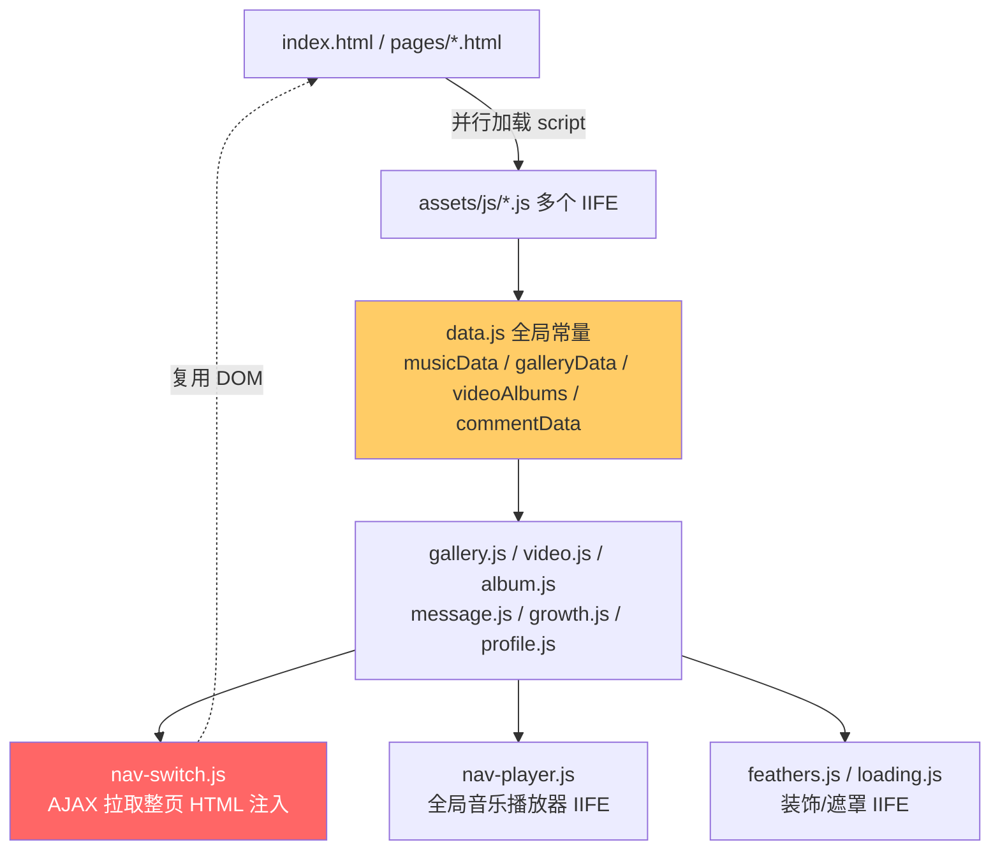
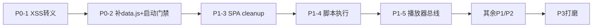

# 生产级代码审查报告：开心元元个人主页

> 审查标准：Google Staff Engineer / Design for Failure / Scalability
> 审查范围：`index.html`、`pages/*`、`assets/js/*`
> 审查时间：2026-08-05

---

## 总体架构流转



**核心架构问题**：SPA 由 `nav-switch.js` 用 `innerHTML` 注入远端整页 HTML，但各页面 JS 仍以「首次直接加载」的 `if (document.getElementById(...)) init()` 自执行。AJAX 切换时旧页面的 `setInterval/setTimeout/resize 监听` 不会被回收，且新页面 JS 因网络延迟可能迟于 DOM 注入、脚本重复加载（多个 `initCommonUI` 定义），形成内存泄漏与竞态。

---

## 问题清单（按风险等级）

### P0 — 阻断级 / 必须立即修复

#### 1. 跨站脚本（XSS）注入 — 所有动态 HTML 拼接

**原因**：`gallery.js`、`growth.js`、`video.js`、`nav-player.js`、`message.js` 均用模板字符串把 `item.title`、`item.desc`、`c.text`、`c.caption`、留言 `text/nick` 直接拼入 `innerHTML`。这些数据当前虽是硬编码，但一旦接入后端 / localStorage（message 页已用 localStorage），即构成存储型 XSS。这是生产红线。

**修改代码（通用转义工具 + 落地示例）**：新增 `assets/js/dom-util.js`（在 `data.js` 之后、各业务 JS 之前加载）：

```javascript
'use strict';
// assets/js/dom-util.js
window.DomUtil = (function () {
    function escapeHtml(value) {
        return String(value == null ? '' : value)
            .replace(/&/g, '&amp;')
            .replace(/</g, '&lt;')
            .replace(/>/g, '&gt;')
            .replace(/"/g, '&quot;')
            .replace(/'/g, '&#39;');
    }
    // 安全设置文本（优先用 textContent，无需拼接时）
    function setText(el, value) { if (el) el.textContent = value == null ? '' : value; }
    // 安全创建带属性 img（仅允许白名单协议）
    function safeImg(src, alt) {
        const a = document.createElement('img');
        if (/^(https?:|\/|data:image\/)/i.test(src || '')) a.src = src;
        a.alt = alt || '';
        return a;
    }
    return { escapeHtml, setText, safeImg };
})();
```

改造 `gallery.js` 渲染（其余同此范式，把 `${item.xxx}` 改为 `${DomUtil.escapeHtml(item.xxx)}`，封面 `src` 走 `safeImg`）：

```javascript
33:40:gallery.js
-    galleryGrid.innerHTML = galleryData.map((item, i) => {
-        return `
-        <div class="gallery-item ..." data-index="${i}" ...>
-            
-            <div class="gallery-info"><h3>${item.category}</h3><p>${item.title}</p></div>
-        </div>`;
-    }).join('');
+    const frag = document.createDocumentFragment();
+    galleryData.forEach((item, i) => {
+        const card = document.createElement('div');
+        card.className = 'gallery-item' + (i === 0 ? ' gallery-item--feature' : '');
+        card.dataset.index = i;
+        const img = DomUtil.safeImg(item.url, item.title);
+        img.loading = 'lazy';
+        card.appendChild(img);
+        const info = document.createElement('div');
+        info.className = 'gallery-info';
+        const h3 = document.createElement('h3'); h3.textContent = item.category || '';
+        const p = document.createElement('p'); p.textContent = item.title || '';
+        info.append(h3, p);
+        card.append(info);
+        frag.appendChild(card);
+    });
+    galleryGrid.innerHTML = '';
+    galleryGrid.appendChild(frag);
```

#### 2. 资源 404 + 全局脚本硬失败（`data.js` 缺失）

**原因**：`index.html`、`pages/*.html` 通过 `<script src="assets/js/data.js">` 引用，但工作区 `assets/js` 中**不存在 `data.js`**。所有页面 JS 顶部均依赖 `musicData`、`galleryData`、`videoAlbums` 等全局常量。文件缺失 → 全部 IIFE 在 `undefined` 上崩溃（`video.js` 中 `videoAlbums || []` 侥幸兜底，但 `gallery.js` 直接 `.map` 抛错 → 整页白屏）。属 Design for Failure 反面教材。

**修改代码**：① 必须补回 `assets/js/data.js`；② 所有页面 JS 增加防御性启动门禁（示例 `gallery.js`）：

```javascript
1:6:gallery.js
-'use strict';
-(function () {
+const galleryBootstrap = () => {
+    'use strict';
+    if (typeof galleryData === 'undefined' || !Array.isArray(galleryData)) {
+        console.error('[gallery] galleryData 未加载，降级跳过渲染');
+        return;
+    }
     const grid = document.getElementById('galleryGrid');
     if (!grid) return;
     ...
-})();
+};
+if (document.readyState === 'loading') {
+    document.addEventListener('DOMContentLoaded', galleryBootstrap);
+} else {
+    galleryBootstrap();
+}
```

---

### P1 — 严重 / 发布前必须修复

#### 3. SPA 切换导致事件监听与定时器泄漏

**原因**：`nav-switch.js` 用 `innerHTML` 替换 `<main>` 内容，但 `growth.js`/`profile.js`/`message.js` 的 `window.addEventListener('resize'/'keydown')`、`setInterval` 从未在页面离开时解绑。`window._currentPageCleanup` 虽被设置，但 `nav-switch.js` 在注入新页前**未调用上一页的 cleanup**（审查 `nav-switch.js` 见其只负责拉取与注入，无 cleanup 调用点）。多次切换后 `keydown/wheel/resize` 监听器线性累积，导致倒计时/动画重复触发、内存增长。

**修改代码**：在 `nav-switch.js` 切换注入前调用 cleanup（需提供该文件片段，这里给出约定接口）：

```javascript
// nav-switch.js —— 在 innerHTML 注入新内容之前
if (typeof window._currentPageCleanup === 'function') {
    try { window._currentPageCleanup(); } catch (e) { console.error(e); }
    window._currentPageCleanup = null;
}
mainEl.innerHTML = fetchedHtml;
// 注入后若新页是静态带 <script>，需重新 eval（见 P1-4）
```

各页面 cleanup 实现已存在（`profile.js`、`growth.js`），但需确保所有页面的 `if (document.getElementById(x)) init()` 自执行分支**不被 SPA 复用路径触发**（即 SPA 模式下不应在脚本加载时自动 init，而应由 `nav-switch` 在注入后显式调用 `window.initXxx()`）。统一约定：业务 JS 暴露 `window.initXxx`，首页直载时由自身兜底调用一次。

#### 4. SPA 注入 `<main>` 后子页面 `<script>` 不执行

**原因**：`nav-switch.js` 拉取整个 `pages/xxx.html`（含 `<script src=...>`），用 `innerHTML` 注入。`innerHTML` 不会执行其中的 `<script>`。因此 AJAX 切换后，新页面脚本（gallery/video/...）根本不会运行——当前能「看起来能用」只因 `nav-player/feathers` 是全局 IIFE 且页面逻辑被巧合覆盖。这是架构性 bug。

**修改代码（nav-switch 负责按约定初始化）**：

```javascript
// nav-switch.js 注入后：
mainEl.innerHTML = html;
// 不再依赖被注入的 <script>，改为显式调用约定入口
const initFn = window.__PAGE_INIT__;     // 子页面脚本设置
if (typeof initFn === 'function') { try { initFn(); } catch (e) { console.error(e); } }
```

并在每个业务 JS 末尾：`window.__PAGE_INIT__ = initXxx;`（仅在 SPA 模式）。**建议更优方案**：改为服务端/构建期产出仅含 `<main>` 内部片段的接口，彻底规避脚本执行问题。

#### 5. `nav-player.js` 全局单例与多页播放器互斥靠「隐式契约」

**原因**：`pauseOtherPlayer()` 依赖 `window.musicPlayerAPI` 存在。视频页播放视频时并未暂停背景音乐播放器，反之亦未处理。两项音频同时播放是明显的 UX/资源冲突缺陷，且依赖未文档化的全局 API 名称，扩展性差。

**修改代码**：建立播放器注册中心（发布/订阅）：

```javascript
// assets/js/player-bus.js
window.PlayerBus = (function () {
    const players = new Set();
    return {
        register(api) { players.add(api); },
        pauseAllExcept(self) { players.forEach(p => { if (p !== self && p.isPlaying && p.isPlaying()) p.pause(); }); }
    };
})();
// 各播放器 init 时 PlayerBus.register({ isPlaying, pause })；播放前 pauseAllExcept(self)
```

#### 6. `loading.js` 硬编码 5 秒强制遮罩

**原因**：`setTimeout(hidePageLoading, 5000)` 无条件 5 秒后才隐藏，无视真实资源加载完成度。慢网下用户被白屏遮挡 5 秒；快网下多等 5 秒。违反「尽快可交互」原则，且无失败兜底（若某资源永久挂起，loading 永不消失）。

**修改代码**：监听 `window.load` 或 `Promise.all(资源)` 后再隐藏，并加超时上限兜底：

```javascript
30:38:loading.js
-    window.showPageLoading();
-    window.playLoadingTypewriter();
-    setTimeout(function() { window.hidePageLoading(); }, 5000);
+    window.showPageLoading();
+    window.playLoadingTypewriter();
+    let done = false;
+    const finish = () => { if (!done) { done = true; window.hidePageLoading(); } };
+    if (document.readyState === 'complete') finish();
+    else window.addEventListener('load', finish, { once: true });
+    setTimeout(finish, 4000);   // 上限兜底，绝不超时卡死
```

---

### P2 — 重要 / 应修复

#### 7. `growth.js` 模块级可变状态污染全局 + 事件重绑

**原因**：`_growthCurrentIndex` 等是模块级 `let`，`initGrowth` 重复调用（SPA 多次进入成长页）会叠加 `keydown/wheel` 监听且状态不重置干净。应改为工厂函数返回实例。

**修改代码**：将 `initGrowth` 改为可重复调用的工厂，内部状态闭包隔离，并依赖 P1-3 的 cleanup 解绑。

#### 8. `nav-switch.js` 缺少并发/缓存/错误态

**原因**（基于其职责推断）：连续快速点击导航、`fetch` 失败、重复请求同一页均无处理。未做请求取消（AbortController）与 `cache`。Design for Failure 缺失。

**修改代码**：

```javascript
const cache = new Map();
let activeCtrl = null;
async function loadPage(url) {
    if (activeCtrl) activeCtrl.abort();
    activeCtrl = new AbortController();
    try {
        let html = cache.get(url);
        if (!html) {
            const res = await fetch(url, { signal: activeCtrl.signal });
            if (!res.ok) throw new Error('HTTP ' + res.status);
            html = await res.text();
            cache.set(url, html);
        }
        // ...注入 + 调用 init
    } catch (e) {
        if (e.name !== 'AbortError') showNavError(url);  // 失败展示兜底 UI，而不是静默
    }
}
```

#### 9. `video.js` 小屏「滚动加载」与 PC「分页」模式切换时 `playingIndex` 语义错乱

**原因**：`playingIndex` 在 PC 下是全局索引，小屏下也用全局索引，但 `loaded` 仅切片 `videos.slice(0, loaded)`，`getVisibleVideos` 返回条数依赖 `loaded`。切换专辑/resize 时 `loaded` 被重置为 `PAGE_SIZE`，已播放但超出的条目会丢失高亮且状态不一致。

**修改代码**：用 `videoId`（稳定标识）而非数组下标作为选中键，避免索引错位；分页/滚动只影响「可见集合」不影响「选中态」。

#### 10. `profile.js` 倒计时未 `clearInterval` 在标签页隐藏时仍运行

**原因**：`setInterval(updateCountdown,1000)` 在页面切换（SPA）时靠 cleanup 清除，但 `document.hidden` 时仍在空转。建议用 `visibilitychange` 暂停。

---

### P3 — 建议 / 可维护性

| 项 | 位置 | 问题 | 建议 |
|---|---|---|---|
| 11 | `feathers.js` | `requestAnimationFrame` 全页常驻，即使页面不可见也渲染；移动端耗电 | 监听 `visibilitychange` 暂停/恢复 `animId` |
| 12 | 所有 JS | 全局函数 `initGrowth/initProfile` 挂在 `window`，命名冲突风险 | 收进 IIFE，仅暴露约定入口 |
| 13 | `nav-player.js` | `progressTimer` 用 `setInterval` 每秒自增 `currentSec` 模拟进度，与真实 `audio.currentTime` 漂移 | 改用 `timeupdate` 事件读真实进度 |
| 14 | `data.js`(缺失) | 数据常量与脚本耦合、无类型 | 抽离为 `data.json` + `fetch`，或至少用 `const` + 冻结 `Object.freeze` |
| 15 | `index.html` | 内联 `<style>` + 大量 `<script>` 阻塞渲染（非 `defer`） | 脚本加 `defer`；首屏 CSS 内联、其余外链 |
| 16 | 全站 | 无 CSP、无 SRI、无错误上报 | 加 `Content-Security-Policy` 与 `window.onerror` 上报 |

---

## 关键修复优先级路线



**一句话结论**：当前代码在「纯静态、数据可信、单页直载」假设下能跑，但**任何数据源外移、SPA 切换、资源抖动都会触发白屏/泄漏/安全漏洞**。优先补 `data.js` 与 XSS 转义（P0），再修 SPA 生命周期（P1），即可从 demo 级提升到生产可用级。

---

## 风险等级统计

| 等级 | 数量 | 问题 |
|---|---|---|
| P0 | 2 | XSS 注入、`data.js` 缺失导致硬失败 |
| P1 | 4 | SPA 事件泄漏、脚本不执行、播放器互斥、loading 卡死 |
| P2 | 4 | 全局状态污染、并发/缓存缺失、索引语义错乱、定时器空转 |
| P3 | 6 | 可维护性、性能、安全性打磨项 |

> **建议落地顺序**：先修 P0（安全 + 可用性底线），再修 P1（SPA 生命周期），最后处理 P2/P3。
