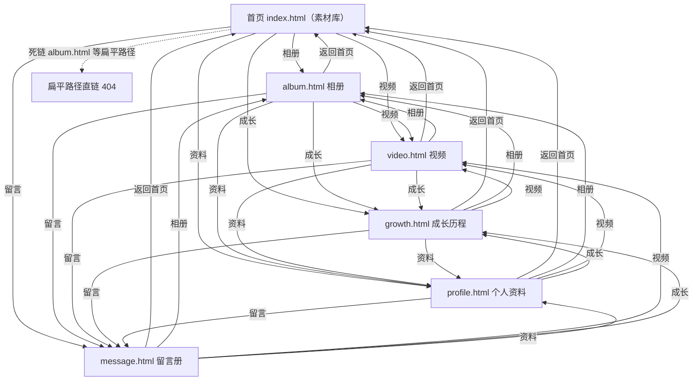
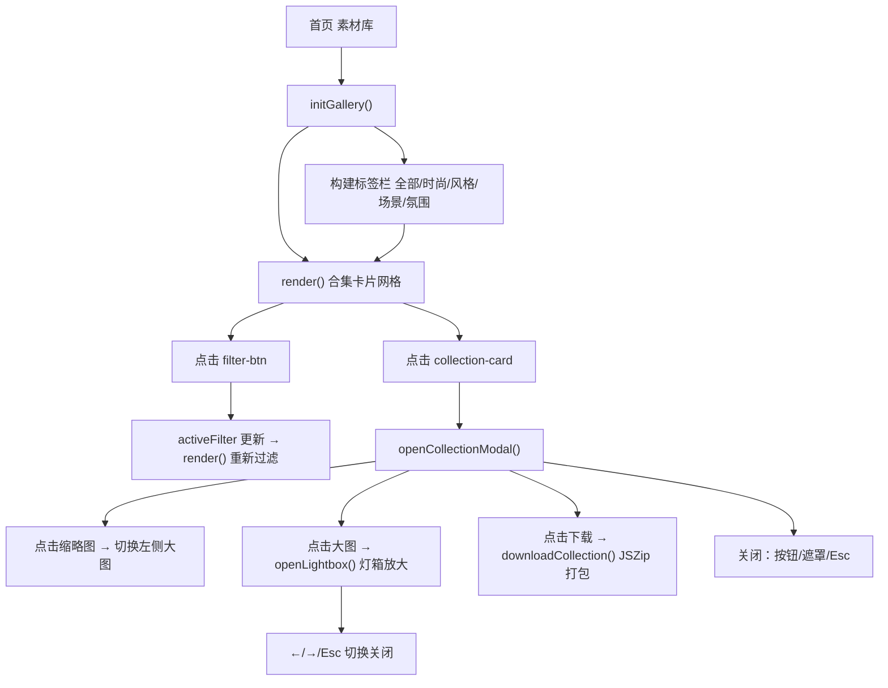
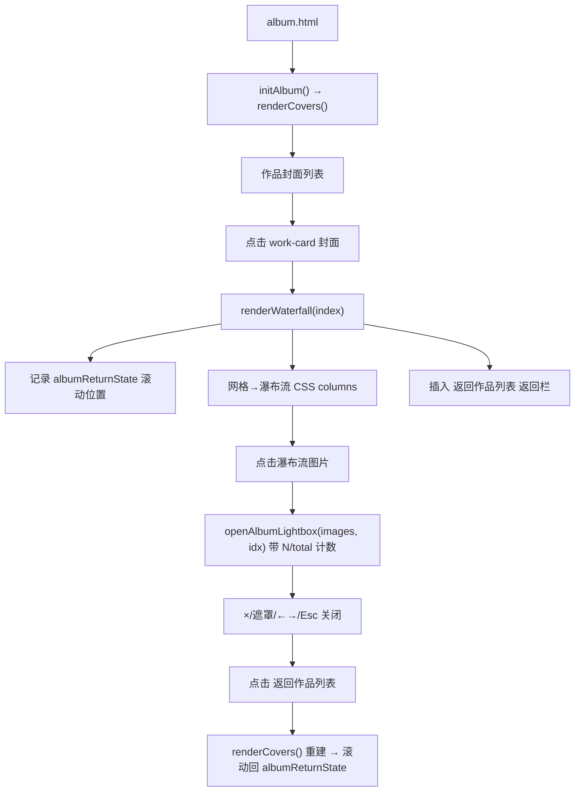
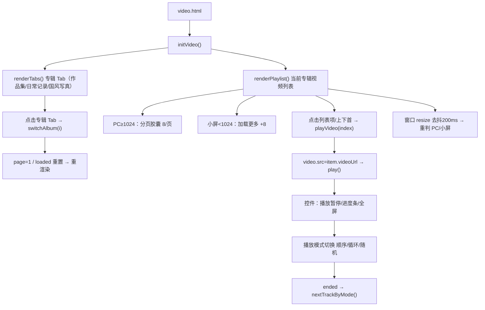
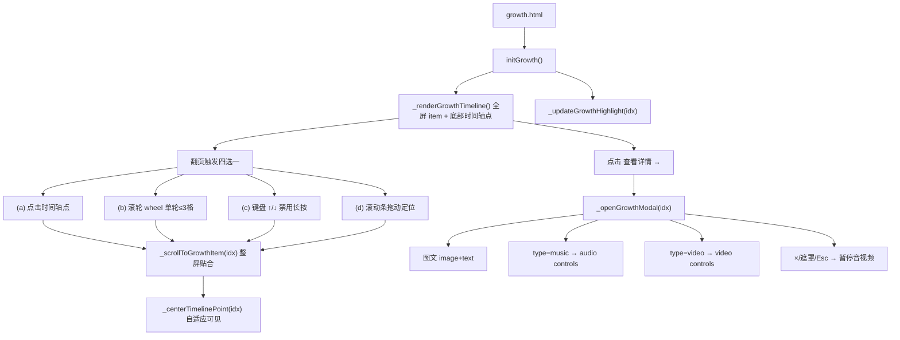
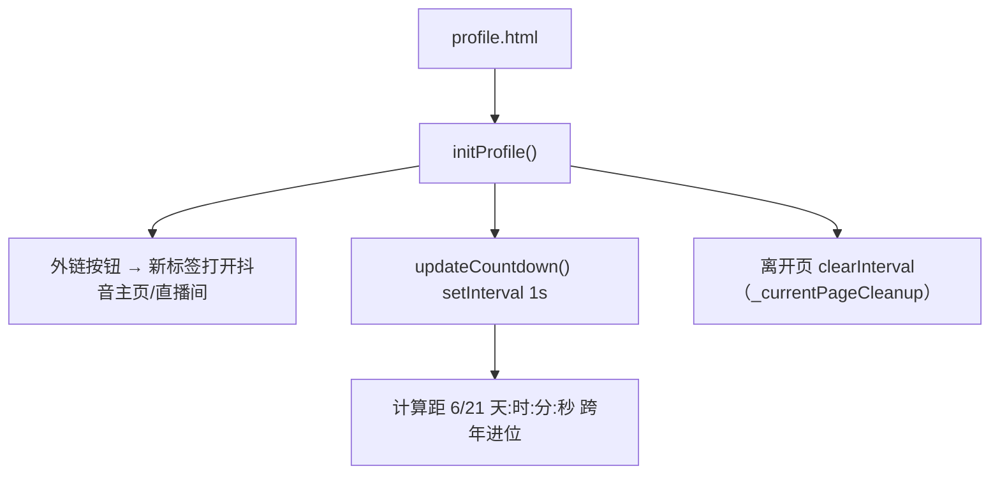
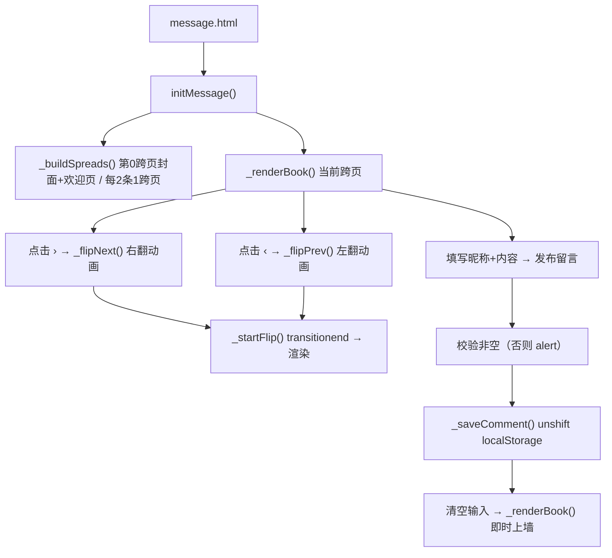

# 开心元元个人粉丝站（kxyy）· 项目说明书（旧版静态站）

> 文档性质：旧项目（原生静态站）的功能、交互与技术现状说明书。
> 编写依据：以 `docs/页面描述.md`（QA 拓扑）、`docs/需求说明.md`、`docs/pages.md`（交互图谱）、`docs/CodeReview.md`（代码评审）为基础整合重写。
> 范围限定：**仅针对旧项目 `index.html`（`pages/` 子页面及其相关的 `assets/js/*`、`assets/css/*` 文件）**，不含 Vue 重构（`web/`、`api/`）相关内容。
> 编写日期：2026-08-10

---

## 一、项目整体功能描述

开心元元个人粉丝站是一个**偶像「开心元元」的非官方个人粉丝站**，面向手机端访问为主、PC 大屏兼顾的用户群体。站点以图文、视频、音乐、留言等形式为粉丝提供内容浏览与互动。

### 1.1 核心定位

- **类型**：纯静态多页面站点，**原生 HTML5 + CSS3 + 原生 JavaScript**，无构建工具、无后端。
- **内容形态**：相册图集、视频播放、成长时间轴、偶像档案、粉丝留言。
- **交互特色**：导航栏常驻背景音乐播放器（切页不断播）、灯箱放大、全屏翻页、翻书式留言册。

### 1.2 技术栈

| 层次 | 技术 | 说明 |
|------|------|------|
| 结构 | HTML5 | 多页面（`index.html` + `pages/*.html`），子页面可独立整页访问 |
| 样式 | CSS3 | 单全局样式表 `assets/css/style.css`，含毛玻璃、深色玻璃拟态、响应式 |
| 脚本 | 原生 JavaScript（ES5 严格模式 + 部分 IIFE 封装） | 15 个 `<script>` 顺序加载，无模块化、无打包 |
| 数据 | 硬编码 `assets/js/data.js` | 图片/音乐/视频/作品/成长/留言数据集全局声明 |
| 持久化 | 浏览器 `localStorage` | 仅留言册用户发布内容持久化 |
| 路由 | `history.pushState` + `fetch` 片段注入（设计意图为 SPA 无刷新切页） | 见 §三 与 §六 缺陷说明 |

### 1.3 资源组织

```
kxyy/
├── index.html          # 首页 Shell ＝ 素材库（脚本 gallery.js）
├── pages/              # 独立子页面（可整页访问，亦被 SPA 注入）
│   ├── album.html      # 相册（脚本 album.js / initAlbum）
│   ├── video.html      # 视频（脚本 video.js / initVideo）
│   ├── growth.html     # 成长历程（脚本 growth.js）
│   ├── profile.html    # 个人资料（脚本 profile.js）
│   └── message.html    # 留言册（脚本 message.js）
├── assets/
│   ├── css/style.css    # 全局样式
│   ├── js/              # data.js / main.js / nav-player.js / gallery.js /
│   │                   #   album.js / video.js / growth.js / profile.js /
│   │                   #   message.js / comment.js / common-ui.js /
│   │                   #   loading.js / feathers.js / nav-switch.js
│   ├── img/{global,works,growth,avatar}/
│   ├── video/          # 视频资源
│   └── music/          # 音频资源
```

### 1.4 全局硬性要求（双端验收底线）

> **PC 大屏（桌面）与手机小屏（移动视口）必须同时兼顾。**
> 任何 BUG 定位、功能/样式/交互改动，均须在大屏与小屏分别复现、验证，两端均通过才算完成；目标用户仍以手机端访问为主，不得为技术栈牺牲移动端体验。

---

## 二、站点拓扑结构

### 2.1 站点总拓扑（Mermaid）



> 实测：49 条导航边构成首页与各子页的全连接导航。**扁平路径直链（如 `/album.html`）会 404**——真实文件在 `pages/` 子目录，直接输入扁平 URL 会丢失样式/脚本路径（见 §六 P0）。

### 2.2 全局共享外壳（所有页面共用）

```
┌─────────────────────────────────────────────────────────────┐
│  Navbar（固定导航栏）                                       │
│  ┌────────┐  ┌────────────────────────────┐  ┌──────────┐   │
│  │ Logo   │  │ 相册 素材库 个人资料 视频 │  │ [音乐]   │   │ 
│  │ 首页   │  │ 成长历程 留言              │  │ (汉堡)   │   │
│  └────────┘  └────────────────────────────┘  └──────────┘   │
└─────────────────────────────────────────────────────────────┘
                              │
        ┌─────────────────────┴──────────────────────┐
        ▼                                            ▼
┌──────────────────────┐                    ┌──────────────────┐
│  #pageContainer      │                    │ 全局浮层（不随   │
│  （页面内容，切换时  │                    │ 切换重建）       │
│   被 AJAX 替换）     │                    │ · lightbox 灯箱 │
│                      │                    │ · 导航栏播放器   │
└──────────────────────┘                    │ · back-to-top   │
                                            └──────────────────┘
```

### 2.3 全局交互线路（设计意图）

```
用户点击 nav-link
      │
      ▼
nav-switch 拦截默认跳转 ──► fetch 目标页 HTML 片段
      │                         │
      ▼                         ▼
cleanupPage() ◄──── 清理上一页定时器/监听器/弹窗
      │
      ▼
替换 #pageContainer 内容 + 重建浮层
      │
      ▼
更新标题 / 导航 active / 滚动置顶 / history.pushState
      │
      ▼
调用目标页初始化函数（INIT_MAP）→ hideLoading()
```

### 2.4 全局播放器（nav-player）

点击 🎵 按钮 → 图标旋转 360° 并 cross-fade 变头像 → 左右面板双向展开（上一首/播放-暂停/下一首 + 歌名-歌手）。后台 `<audio>` 始终存活，**切页音乐不中断**。点击播放列表项切歌；播放结束自动下一曲。

### 2.5 公共 UI（common-ui）

导航栏滚动毛玻璃、回到顶部按钮（滚动 >300px 显隐）、移动端汉堡菜单展开/收起。

### 2.6 跨页面数据依赖

```
                         data.js（单一数据源）
        ┌────────────┬────────────┬──────────┬──────────┬────────────┐
        ▼            ▼            ▼          ▼          ▼            ▼
   galleryData   worksData   videoAlbums  growthData  messageData  musicData
        │            │            │           │           │            │
        ▼            ▼            ▼           ▼           ▼            ▼
    素材库页      相册页       视频页     成长历程页    留言页     全局播放器
   (gallery.js) (album.js)  (video.js)  (growth.js)  (message.js) (nav-player.js)
        │
        └─ galleryImages[]（扁平图片索引）被 worksData / videoAlbums / growth.js 共用引用
```

> 说明：`growth.js` 内另定义 `growthDataExtended`（13 条）为实际渲染源，`data.js` 的 `growthData`（8 条）与之重叠冗余（见 §六 P2）。

---

## 三、各页面交互逻辑图表

> 路由机制说明：设计意图为「SPA 无刷新切页」（`nav-switch` 拦截导航、`fetch` 注入 `#pageContainer` + `pushState`）。但实测因多模块未暴露 `window.initXxx`，**切到相册/成长/资料/留言时交互失效**（见 §六 P1）。子页面亦可整页直接访问（此时自执行守卫触发，功能正常）。

### 3.0 素材库（首页 · `index.html`）

**功能**：以"素材合集"卡片网格展示图库，按分类标签筛选；点击合集打开弹窗，弹窗内可切换缩略图、放大查看、批量打包下载（JSZip）。

**数据流**：`galleryData[]`（title / author / filter / cover / desc / images[]）。



灯箱键位：`←` 上一张 · `→` 下一张 · `Esc` 关闭。

---

### 3.1 相册（`pages/album.html`）

**功能**：展示多个"作品"封面卡片；点击封面在**当前页内**展开该作品图片瀑布流（不跳页），可返回且不刷新、保留滚动位置；瀑布流图片点击进灯箱。

**数据流**：`worksData[]`（cover / title / desc / likes / views / images[]）。



特点：返回不刷新页面、保留滚动位置；灯箱带 `N / total` 计数器。

---

### 3.2 视频（`pages/video.html`）

**功能**：按"专辑"分组的视频播放器。PC（≥1024px）数字分页胶囊（每页 8 条），小屏（<1024px）关闭分页改"加载更多"滚动加载。支持专辑切换、播放/暂停、上一首/下一首、进度条拖拽、全屏。

**数据流**：`videoAlbums[]` → 每专辑 `{ name, videos[] }`，视频 `{ title, videoUrl, cover, orientation, desc }`。



**播放模式切换（开发中功能，未测试验收）**：`state.playMode` 默认 `'order'`，按钮在 `order → loop → shuffle → order` 循环。`nextTrackByMode()`：顺序到末尾停止；循环回绕 0；随机取非当前索引。切换专辑维持当前模式。
> ⚠️ 该特性为截图确认的新增需求，**未在需求文档登记，且未经测试验收**，列为文档不一致项（见 §六）。

---

### 3.3 成长历程（`pages/growth.html`）

**功能**：全屏时间轴展示里程碑事件，每事件占满一屏；支持时间轴点点击、滚轮、上下键、滚动条拖动切换；"查看详情"弹窗（图文/音频/视频）。

**数据流**：`growth.js` 内 `growthDataExtended[]`（date / title / shortTitle / desc / status / cover / type / content），共 13 条为实际渲染源。



切换核心约束：内容必须完整贴合整屏，不能停在两屏中间；时间轴超可视区须自适应移动保证选中点可见（精确居中列为后续优化）。

---

### 3.4 个人资料（`pages/profile.html`）

**功能**：偶像档案展示 —— 头像卡片、抖音主页/直播间外链按钮、个人档案（6 项网格）、个人简介、生日倒计时。

**数据流**：静态 HTML + `profile.js` 实时计算倒计时。



---

### 3.5 留言册（`pages/message.html`）

**功能**：翻书式"粉丝留言册"。左侧封面+欢迎页，后续每跨页 2 条留言卡片；支持翻书动画；底部表单发布留言（存 `localStorage`，即时上墙）。**本站唯一含用户表单输入的页面。**

**数据流**：内置 `messageData[]` + `localStorage['kaixin_yuanyuan_comments']`。



留言卡片按昵称哈希生成渐变头像 + 首字母；**HTML 转义防 XSS（本站正确示范）**。

---

## 四、统一交互模式小结

| 模式 | 出现页面 | 说明 |
|------|----------|------|
| AJAX 无刷新切换（设计） | 全部 | nav-switch 拦截导航、fetch + 替换 #pageContainer（⚠️ 实测多页失效，见 §六） |
| 灯箱放大 | 素材库、相册 | 复用 `#lightbox`，←/→/Esc 控制 |
| 详情弹窗 | 素材库、成长历程 | 遮罩 + × + Esc 关闭，打开锁 body 滚动 |
| 分页 vs 加载更多 | 视频 | ≥1024px 数字胶囊；<1024px 加载更多 |
| 全屏一格翻页 | 成长历程 | 滚轮/方向键/触摸，单轮≤3格 |
| 翻书动画 | 留言 | 3D 翻转过渡（transitionend 回调） |
| 实时计时 | 个人资料 | 生日倒计时 setInterval 1s |
| 本地持久化 | 留言 | localStorage 存储用户发布留言 |
| 全局音乐不断播 | 全部 | nav-player 后台 audio 跨页存活 |

---

## 五、已知需求实现状态（摘要）

> 来源：`docs/需求说明.md`。以下仅摘录与旧页面相关的核心项，完整路线图见原文档。

| 模块 | 关键需求 | 状态 |
|------|----------|------|
| 全局 | 双端（大屏/小屏）兼顾验收 | ✅ 强制要求 |
| 视频 | 专辑 Tab 切换、PC 分页/小屏滚动、横竖屏适配、进度条 seek、列表选中修复 | ✅ 已实现/修复 |
| 相册 | 每行 4 个 + 统一高度、封面按真实宽高比（未强制 9:16） | ✅/⬜ 部分 |
| 数据 | videoAlbums 去 artist 加 desc、avatar 路径规范化 + 兜底 VA.png | ✅ |
| 资源 | 统一迁入 `assets/`（css/js/img/video/music） | ✅ |
| 素材库 | 合集卡片 16:9 + 弹窗左大图右列表 + JSZip 打包下载 | ⬜ 待实现 |
| 相册 | 封面点击平铺瀑布流（保留灯箱） | ⬜ 待实现 |
| 建议页 | 弹幕风格建议页 | ⏸ 暂缓 |
| 导航播放器 | 展开交互/B4 列表等宽/B5 小屏歌手歌名 | 🐛 待修复 |

**历史已修复 BUG**：B1 列表选中样式停留第一项、B2 进度条回跳（均已修复）。
**待修复 BUG**：B3 展开入口不明显、B4 列表宽度不等宽、B5 小屏不显示歌名。

---

## 六、遗留问题与改进意见

> 综合自 `CodeReview.md`（生产级评审）与 `页面描述.md`（QA 报告）。按 P0/P1/P2 分级。

### 6.1 🔴 P0 —— 必须修复（安全 / 核心可用性）

**P0-1 XSS：用户/外部数据未转义拼入 innerHTML（高危）**
- 位置：`gallery.js` / `album.js` / `video.js` / `growth.js` 多处 `item.*` 直接拼入 `innerHTML`。
- 攻击面：相册/视频/成长数据若未来接入用户投稿或 CMS 将直接 XSS；`growth.js` 的 `videoUrl/audioUrl` 为外部 `https://` 地址拼入 `src`，存在 `javascript:` 协议注入风险。
- 现状对比：`comment.js` 的 `_escapeHtml` 做得正确（留言册已转义），**标准不统一**。
- 改进：建立单一 `esc()` 工具全量使用；对 `url/src` 做协议白名单 `safeUrl()`；优先 `textContent`/`setAttribute` 替代 `innerHTML` 拼接。

**P0-2 SPA 切页资源路径黑洞 → 404 + 样式/脚本全失效（高危可用性）**
- `nav-switch.js` 的 `getPageUrl` 用 `indexOf('/pages/')` 推断前缀，子页面资源写相对路径；扁平路径 `/album.html` 直开时 `../assets/...` 全部 404。
- 改进：① 统一单一入口，URL 用干净路径（如 `/album`）并部署 SPA fallback（需支持 rewrite 的静态托管）；② 或改为纯多页（导航整页跳转，更简单稳）；③ 资源一律用绝对路径 `/assets/...`。

### 6.2 🟠 P1 —— 架构与健壮性（应修复）

**P1-1 init 函数暴露不一致（SPA 切页交互静默失效）**
- `gallery/profile/growth/message.js` **未暴露 `window.initXxx`**，仅依赖自执行守卫。SPA 切到这些页时 `window[initFn]` 为 `undefined` 被静默跳过 → **内容注入但交互未绑定**。实测：首屏直载 album.html 正常，但从首页 AJAX 切到相册则卡片点击/弹窗全部失效。
- 改进：每个页面模块统一仅通过 `window.initXxx` 暴露，删除自执行守卫，初始化完全交给 `nav-switch`。

**P1-2 事件监听泄漏 / cleanup 不一致**
- `album.js:169` 调用 `_closeWorksLightbox()`（**函数不存在**，应为 `_closeAlbumLightbox`）→ cleanup 抛错被吞。
- `video.js` **未注册 `_currentPageCleanup`**，其 `resize`/`timeupdate` 监听永不清理 → 多次切页叠加多个播放器。
- 改进：修复笔误；强制 `initXxx` 必须返回/注册 cleanup；推荐 `AbortController` 统一托管页面级监听。

**P1-3 双播放器实例冲突与互斥逻辑脆弱**
- `nav-player.js` 与 `growth.js` 弹窗 `<audio>` 多实例共存，导航音乐与成长弹窗音乐可**同时播放（双声）**；`nav-player` 用 `setInterval` 模拟进度与真实 `timeupdate` 脱节，导致自动切歌判断失准。
- 改进：单例 `PlayerManager`；以 `audio.currentTime`+`timeupdate` 为唯一时间源；事件总线解耦。

**P1-4 SPA 切页 fetch 全量 HTML 浪费与解析风险**
- 每次 fetch 整页 HTML 仅取 `#pageContainer` 片段，且注入的 `<script>` 不执行 → 子页初始化完全依赖 `window.initXxx`（回归 P1-1）。
- 改进：拆分"纯片段"接口或约定子页无内联脚本。

**P1-5 全局命名空间污染**
- `data.js` 裸 `const` 隐式全局；各模块挂 `window.initXxx`/`window.navPlayer` 等；裸 `let` 全局声明冲突风险。
- 改进：上 ES Modules（`type="module"`）或单一 `window.KXYY` 命名空间。

### 6.3 🟡 P2 —— 可维护性 / 代码质量

**P2-1 重复数据（data.js / growth.js）**
- `commentData`（comment.js）与 `messageData`（data.js）内容完全相同（4 条）。
- `growthData`（data.js，8 条）与 `growthDataExtended`（growth.js，13 条）高度重叠，且 `growth.js` 末尾重新定义 data.js 已有条目。
- ⚠️ **视频列表复制 3 倍 Bug**：`videoAlbums[1].videos`（日常记录）把同一组视频**重复 3 遍**，会直接导致"日常记录"专辑显示 3 倍重复视频。
- 改进：单一数据源；删除 `commentData` 重复；`growth` 合并按 date 排序；**修正视频列表复制错误**。

**P2-2 魔法字符串 / 常量散落**
- `nav-switch.js` 中 `indexOf('album')` 等页面推断逻辑出现 4 次，应抽 `PAGE_CONFIG` 路由表。
- `'show'/'active'/'playing'` 状态类名、动画时长 `800/300/650ms` 硬编码，应与 CSS 单一来源。

**P2-3 路径推断脆弱**
- `indexOf('album') !== -1` 子串匹配，未来 `albums.html` 等会误判 → 改用精确路径/路由表。

**P2-4 错误处理与降级**
- `nav-switch` catch 降级 `window.location.href = pageUrl` 相对路径拼错易 404；`playTrack` 吞掉自动播放被拒错误无反馈；`extractContent` 取不到片段时静默清空首页。

**P2-5 无障碍 / 语义**
- 灯箱/弹窗缺 `aria-label`/`role="dialog"`；`nav-player` 展开区无 `aria-expanded`；懒加载图缺 `aspect-ratio` 占位致跳动。

**P2-6 性能**
- 无构建/压缩/bundling，15 个 `<script>` 顺序加载首屏阻塞；建议合并 + `defer`，长期上 Vite。

### 6.4 文档一致性问题（说明书编写时发现的冲突）

| # | 冲突点 | 处理结论 |
|---|--------|----------|
| 1 | 导航模式：文档称 SPA 无刷新，CodeReview 证明多页失效 | 同时呈现"设计意图"与"实测缺陷"（§三 说明 + §六 P1-1） |
| 2 | 成长数据源：`pages.md` 写 `growthDataExtended`，CodeReview 指与 `growthData` 重叠 | 以 `growthDataExtended`（13 条）为渲染源，标注 `growthData` 冗余（§二 2.6 + §六 P2-1） |
| 3 | 视频"播放模式切换"：pages.md 标已实现，需求文档未登记 | 标为**开发中功能、未测试验收**，列入文档不一致（§三 3.2 + 本节） |
| 4 | 视频列表 3 倍重复：CodeReview 指出，QA 图谱未提 | 作为已确认 P2 数据 Bug 写入（§六 P2-1） |

### 6.5 改进落地优先级建议

1. **立即（本周）**：修 XSS（统一 `esc`/`safeUrl`）、修 `_closeWorksLightbox` 笔误、暴露全部 `initXxx`、资源改绝对路径 `/assets/`、修正视频列表 3 倍重复、部署 SPA fallback 或改纯多页。
2. **短期（2–4 周）**：ES Modules 消除全局污染；AbortController 统一 cleanup；单例 PlayerManager 解决双声；合并重复数据。
3. **中期**：上 Vite 构建（defer/打包/压缩）；补 Playwright E2E 与单元测试（当前零测试）；统一状态类名与动画时长常量；补无障碍属性；验收"播放模式切换"等新功能。

---

## 七、正面评价（值得保留）

- 留言册 `comment.js` 的 `_escapeHtml` 与 `localStorage` 容错（`try/catch`）是**正确示范**，应推广。
- `nav-switch` 双层清理设计思路正确，只是执行不彻底。
- `video.js` 响应式分页/省略号逻辑、`growth.js` 的 scroll-snap 高亮 rAF 节流——合理实现。
- 全局播放器"音频常驻、切页不断播"的产品体验考虑周到。

> 总结：这是一个**产品思路清晰、交互丰富**的静态站，但工程化处于"能跑的脚本集合"阶段。按 §六 P0/P1 修复后可达生产可用；上 ES Modules + 构建 + 测试后可称生产级。

---

*本说明书基于 `docs/页面描述.md`、`docs/需求说明.md`、`docs/pages.md`、`docs/CodeReview.md` 整合重写，范围限定于旧项目 `index.html` 与 `pages/` 子页面及其相关 `assets/js/*`、`assets/css/*`。Vue 重构（`web/`、`api/`）相关内容不在此文档范围内。*
